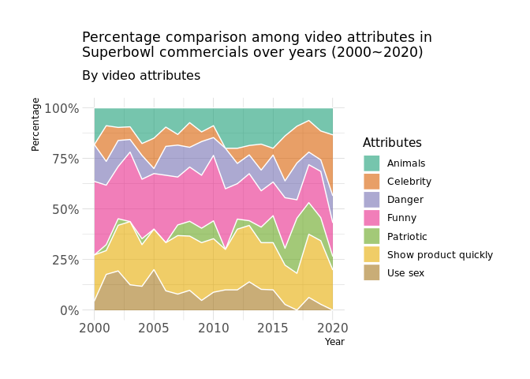
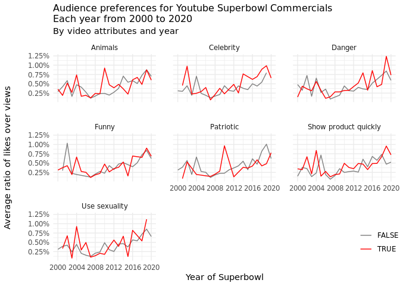
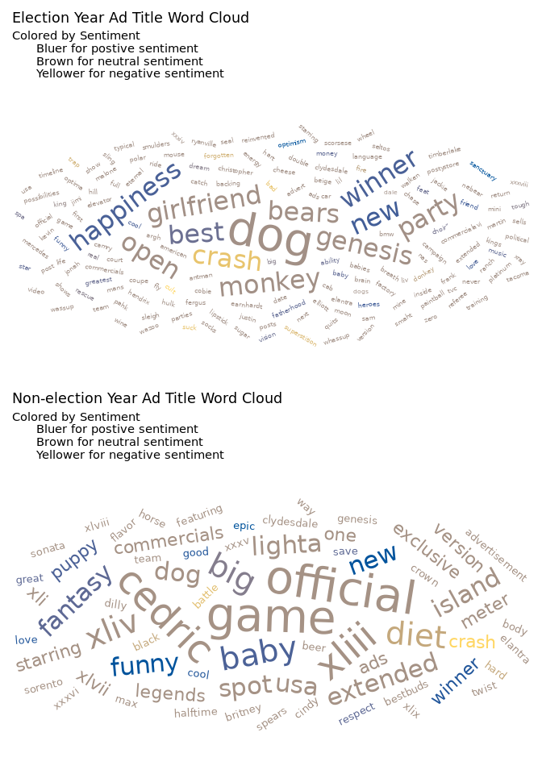
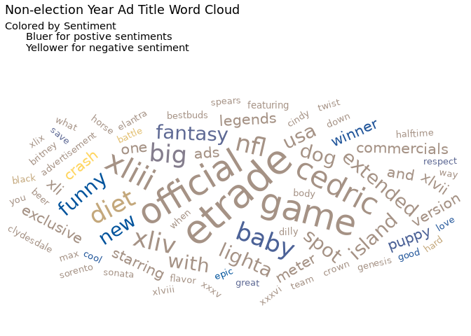

Investigating content and audience reactions to youtube Super Bowl
commercials
================
by R-Mageddon

    ## ── Attaching packages ─────────────────────────────────────── tidyverse 1.3.1 ──

    ## ✓ ggplot2 3.3.5     ✓ purrr   0.3.4
    ## ✓ tibble  3.1.4     ✓ dplyr   1.0.7
    ## ✓ tidyr   1.1.4     ✓ stringr 1.4.0
    ## ✓ readr   2.0.2     ✓ forcats 0.5.1

    ## ── Conflicts ────────────────────────────────────────── tidyverse_conflicts() ──
    ## x dplyr::filter() masks stats::filter()
    ## x dplyr::lag()    masks stats::lag()

    ## 
    ## Attaching package: 'lubridate'

    ## The following objects are masked from 'package:base':
    ## 
    ##     date, intersect, setdiff, union

    ## Loading required package: viridisLite

    ## NOTE: Either Arial Narrow or Roboto Condensed fonts are required to use these themes.

    ##       Please use hrbrthemes::import_roboto_condensed() to install Roboto Condensed and

    ##       if Arial Narrow is not on your system, please see https://bit.ly/arialnarrow

    ## 
    ## Attaching package: 'scales'

    ## The following object is masked from 'package:viridis':
    ## 
    ##     viridis_pal

    ## The following object is masked from 'package:purrr':
    ## 
    ##     discard

    ## The following object is masked from 'package:readr':
    ## 
    ##     col_factor

    ## Loading required package: NLP

    ## 
    ## Attaching package: 'NLP'

    ## The following object is masked from 'package:ggplot2':
    ## 
    ##     annotate

    ## 
    ## Attaching package: 'syuzhet'

    ## The following object is masked from 'package:scales':
    ## 
    ##     rescale

    ## Warning: One or more parsing issues, see `problems()` for details

## Introduction

Our `youtube` dataset contains a list of ads from the 10 brands that had
the most advertisements in Super Bowls from 2000 to 2020, according to
data from superbowl-ads.com, with matching videos found on YouTube. It
was then analyzed by FiveThirtyEight staffers to come up with seven
defining characteristics of a Super Bowl ad: `funny`, `danger`,
`use_sex`, `show_product_quickly`, `celebrity`, `patriotic`, `animals`,
which are represented as boolean variables. Furthermore, we are also
given the `view_count`, `like_count`, `dislike_count`, `favorite_count`,
`comment_count`, `description`, and `title` for each ad.

## Question 1：What’s the trend in the ads’ content, audience preferences, and engagement over the years?

### Introduction

We want to explore the trends in how the ads change over the years in
terms of content, audience preferences, and engagement. To analyze the
change in content we use the logical variables
`funny`,`danger`,`use_sex`,`patriotic`, `show_product_quickly`,
`celebrity`, and `animals`. To explore audience preference and
engagement,`like_count`, `comment_count`, and `view_count` are used to
calculate ratio of like/engagement over total views.

Many things have changed in the first 20 years of the 21st century.
There are life science breakthroughs, political conflicts, feminist
movements, etc. Therefore, we want to see if people’s reaction to Super
Bowl commercials reflect the changes in their lifestyles and thoughts
over the years. The changes in the ads themselves may also tell how
companies are reacting to audience preferences.

### Approach

First, we used a stacked area chart to see how the proportion of each
video feature changes over years. Here, a stacked area chart is used
because with continuous lines connecting and separating the elements in
same group, it is visually compatible when we plan to have year (a time
variable) as our x axis. More specifically, over the years on the x
axis, we can compare the relative percentage change of each feature on
the y axis with areas divided by lines while also linking them together.

For the second plot, we used a line graphs faceted by `feature`, a
variable that is created using all logical variables in the data set.
The faceted line graph is suitable for time-dependent changes by each
categorical variable. Because the logical variables are either true or
false, 2 different lines in each sub-plot clearly show how the trends
(audience preference in this case) differ if an ad contains a feature or
not.

### Analysis

``` r
# First, create a function that returns total count of a specific feature in one year.
count_feature_number <- function(data, feature_name, desired_year){
  count1 = 0
  for (i in seq(1, nrow(data))){
    if (data$year[i] == desired_year){
      if (data[i, feature_name] == TRUE){
        count1 = count1 + 1
      }
    }
  }
  return(count1)
}
# With help from the counter above, we define a new function that creates a 
## generalized feature counting dataframe for a single year.
generator <- function(data, year){
  funny_count = count_feature_number(data, "funny", year) 
  show_quickly_count = count_feature_number(data, "show_product_quickly", year)
  patriotic_count = count_feature_number(data, "patriotic", year)
  celebrity_count = count_feature_number(data, "celebrity", year)
  danger_count = count_feature_number(data, "danger", year)
  animals_count = count_feature_number(data, "animals", year)
  use_sex_count = count_feature_number(data, "use_sex", year)
  
  year_value <- rep(year, 7)
  count_of_feature <- c(funny_count, show_quickly_count, patriotic_count, 
                        celebrity_count, danger_count, animals_count, 
                        use_sex_count)
  features <- c("funny", "show_product_quickly", "patriotic", 
                "celebrity", "danger", "animals", "use_sex")
  year_table <- cbind(year_value, count_of_feature, features)
  year_df <- as.data.frame(year_table)
  return(year_df)
}
# Then, using the "appender" function below to get the final dataframe for 
## all years from 2000 to 2020. 
appender <- function(data){
  year_general_df <- generator(data, 2000)
  for (j in seq(2001, 2020)){
    year_general_df <- rbind(year_general_df, 
                             generator(data, j))
  }
  return(year_general_df)
}
# Use the function and get our desired plot
youtube1 <- youtube
year_feature_df <- appender(youtube1)
year_feature <- year_feature_df %>%
  mutate(
    year_value = as.numeric(as.character(year_value)),
    count_of_feature = as.numeric(as.character(count_of_feature))
  ) %>%
  group_by(year_value, features) %>%
  summarise(n = sum(count_of_feature)) %>%
  mutate(percentage = n / sum(n))
```

    ## `summarise()` has grouped output by 'year_value'. You can override using the `.groups` argument.

``` r
year_feature
```

    ## # A tibble: 147 × 4
    ## # Groups:   year_value [21]
    ##    year_value features                 n percentage
    ##         <dbl> <fct>                <dbl>      <dbl>
    ##  1       2000 animals                  4     0.182 
    ##  2       2000 celebrity                0     0     
    ##  3       2000 danger                   4     0.182 
    ##  4       2000 funny                    8     0.364 
    ##  5       2000 patriotic                0     0     
    ##  6       2000 show_product_quickly     5     0.227 
    ##  7       2000 use_sex                  1     0.0455
    ##  8       2001 animals                  3     0.0882
    ##  9       2001 celebrity                6     0.176 
    ## 10       2001 danger                   4     0.118 
    ## # … with 137 more rows

``` r
# Plot stacked area chart
ggplot(year_feature, aes(x = year_value, y = percentage, fill = features)) + 
    geom_area(alpha=0.6 , size=.5, colour="white") +
    scale_y_continuous(labels = label_percent(accuracy = NULL, scale = 100, 
                                              prefix = "", suffix = "%", 
                                              big.mark = " ", 
                                              decimal.mark = ".", 
                                              trim = TRUE)) +
    labs(
      x = "Year", 
      y = "Percentage", 
      fill = "Features",
      title = "Percentage comparison among video features in\nSuperbowl commercials over years (2000~2020)",
      subtitle = "By video features"
    ) + 
    theme_ipsum() +
    scale_fill_brewer(palette = "Dark2") +
    theme(
      plot.title = element_text(hjust = 0, size = 13)
    )
```

<!-- -->

``` r
# create compare function for different 
# Function was written with the help of TA
create_compare <- function(varname, full_data) {
  full_data <- full_data %>% 
    # drop N/A value for key variables 
    drop_na({{varname}}, like_count, view_count, dislike_count, comment_count) %>% 
    # create new variables for preference, dislike, engagement, and features
    mutate(like = like_count / view_count,
           dislike = dislike_count / view_count,
           engage = comment_count / view_count,
           feature = as_label(enquo(varname))) %>% 
    select({{varname}}, like, dislike, engage, feature, year) %>%
    rename(val = as_label(enquo(varname)))
  return(full_data)
}
```

``` r
# create a new data frame that contains key variables from above 
all_compare <- rbind(create_compare(funny, youtube),
                     create_compare(danger, youtube),
                     create_compare(show_product_quickly, youtube),
                     create_compare(patriotic, youtube),
                     create_compare(celebrity, youtube),
                     create_compare(animals, youtube),
                     create_compare(use_sex, youtube)) %>% 
  # change variable names to be more readable
  mutate(feature = recode(feature, 'animals' = 'Animals', 
                          'celebrity' = 'Celebrity', 
                          'danger' = 'Danger',
                          'funny' = 'Funny',
                          'patriotic' = 'Patriotic',
                          'show_product_quickly' = 'Show product quickly',
                          'use_sex' = 'Use sexuality')) %>% 
  group_by(year, feature, val) %>% 
  summarise(mean_like = mean(like),
            mean_engage = mean(engage))
```

    ## `summarise()` has grouped output by 'year', 'feature'. You can override using the `.groups` argument.

``` r
ggplot(all_compare, aes(x = as.numeric(year), y = mean_like)) + 
  geom_line(aes(color = val)) + 
  labs(title = "The rate of audience hitting 'like' for Youtube Superbowl Commercials\nEach year from 2000 to 2020",
       subtitle = "By video features and year",
       x = "Year of Superbowl",
       y = "Average ratio of likes over views") +
  facet_wrap(~feature) +
  scale_color_manual("Feature", values = c("#808080", "#FF0000")) +
  scale_y_continuous(labels = label_percent(accuracy = NULL, scale = 100, prefix = "",
                                            suffix = "%", big.mark = " ",
                                            decimal.mark = ".",
                                            trim = TRUE)) +
  scale_x_discrete(limits=c(2000,2004,2008,2012,2016,2020)) + 
  theme_minimal() +
  theme(axis.title.x = element_text(hjust = 0.5),
        axis.title.y = element_text(margin = margin(r = 20),
                                    hjust = 0.5),
        panel.spacing = unit(1.5, "lines"),
        legend.position = c(0.95, 0.1),
        legend.title = element_blank())
```

    ## Warning: Continuous limits supplied to discrete scale.
    ## Did you mean `limits = factor(...)` or `scale_*_continuous()`?

<!-- -->

``` r
ggplot(all_compare, aes(x = as.numeric(year), y = mean_engage)) + 
  geom_line(aes(color = val)) + 
  labs(title = "The rate of audience comment for Youtube Superbowl Commercials\nEach year from 2000 to 2020",
       subtitle = "By video features and year",
       x = "Year of Superbowl",
       y = "Average ratio of comments over views") +
  facet_wrap(~feature) +
  scale_color_manual("Feature", values = c("#808080", "#FF0000")) +
  scale_y_continuous(labels = label_percent(accuracy = NULL, scale = 100, prefix = "",
                                            suffix = "%", big.mark = " ", decimal.mark = ".", trim = TRUE)) +
  scale_x_discrete(limits=c(2000,2004,2008,2012,2016,2020)) + 
  theme_minimal() +
  theme(axis.title.x = element_text(hjust = 0.5),
        axis.title.y = element_text(margin = margin(r = 20),
                                    hjust = 0.5),
        panel.spacing = unit(1.5, "lines"),
        legend.position = c(0.95, 0.1),
        legend.title = element_blank())
```

    ## Warning: Continuous limits supplied to discrete scale.
    ## Did you mean `limits = factor(...)` or `scale_*_continuous()`?

<!-- -->

### Discussion

In the stacked area chart, the percentage or proportion of each video
feature is calculated by first counting the total number of TRUE-valued
Boolean variable in each year (“funny”, “patriotic”, etc.), and then
generate a dataframe with all 21 years together. Thus, we should focus
on the width of each color bands, instead of trying to interpret the
lines. Here, we can see that over the years, `funny` and
`show_product_quickly` take up the highest proportion among the seven
video features. However, both of them are showing a decreasing trend
when it’s around 2020. In fact, other features, such as `patriotic` and
`use_sex`, experiences decreases recently. And `celebrity` is,
nevertheless, having an increasing relative proportion. Feature
`patriotic` takes up the least proportion overall, but it reaches its
peak proportion around 2017.

For line plots, we first look at audience preference of various features
in ads. From 2000 to 2020, the ads that contain dangerous elements are
getting more likes than ads thatdo not contain dangerous elements. There
is no obvious trend that the audience strongly prefer a specific feature
other than `danger` over the years.In certain years, audience feel
strongly about ads that contain specific features. In 2010, ads that
contain `animals` element are liked more than 3 times compared to ads
that do not contain animals. Same observation is shown for ads
containing `patriotic` element in 2010. However, from 2017 to 2020, ads
that contain `patriotic` content become less liked. Ads that use
sexuality are far more liked in 2004 but are less liked in 2015. In
2002, the ads that have no humorous element are liked almost 3 times as
ads that have humorous element.

Then, we look at what kinds of ads elicit the audience to engage by
commenting. In general, the engagement rate is pretty low. Most ads
receive almost no comments. However, in 2004 specifically there is are
significant differences between engagement rate for all features. Ads
that contain `animal`, `funny`, show product quickly, or use sexuality
shows higher engagement compared the ads that don’t contain these
features. On the other hand, ads that don’t contain `celebrity`,
`patriotic`, or `danger` tend to have higher engagement rates.

The year variable used here denotes the Superbowl year where the
commercial was shown. However, some commercials have a different
published date on Youtube. Furthermore, the youtube videos have been
collected from random Youtube users instead of influncers or offial
commercial accounts. Therefore, the views, likes, and engagement also
depend on the account itself.

## Question 2 How do election year ads differ from non-election year ads in terms of content and description?

### Introduction

Our second question aims to explore the difference, if any, between ads
aired during election years compared to those aired during non-election
years. Particularly, we want to analyze if there is any noticeable
difference in the description and content between the election and
non-election year ads. Answering this question involves looking at the
`title` variable to analyze how these ads were described, and then
analyzing the boolean content variables of `use_sex`,
`patriotic`,`funny` ,`celebrity`,`danger`, and `animals` to see if they
had any noticeable differences in their content. Finally, the `year`
variable is also needed to distinguish between election and non-election
years.

We are interested in exploring this question because election years mark
a significant cultural moment in the US. Therefore, we want to see
whether this focus on politics translates into any noticeable effect on
super bowl ads.

### Approach

To analyze the description aspect of our question, we decided to use a
word cloud visualization since we felt it was the most informative way
to visualize what major descriptors are used for the ads. The
alternative way of analyzing `title` that we considered included a bar
char for top 10-20 words. However, we decided to opt for the word cloud
since it provided more information in terms of relative occurrences of
all the words being used (by size). Creating the word cloud involved
cleaning the text (for e.g turning all words lower, removing
punctuation, removing numbers)which was done by the `tm` library. We
also performed sentiment analysis on the words using the
`get_sentiment()` function and colored the word cloud based on the
words’ sentiment score.

To analyze the content aspect, we decided to opt for a column graph with
percentage values of each content category as labels of the
visualization. Possible alternative that we considered was a pie chart
but since our column graph shows the percentage values as well as count
values, we decided to go for the visualziation that maximized
information.

### Analysis

``` r
# Election years in the dataset
election_year <- c(2000, 2004, 2008, 2012, 2016, 2020)
# Adding an election year variable
youtube <- youtube %>%
  mutate(election_years = ifelse(year %in% election_year, 1, 0))
test <- youtube %>%
  filter(election_years == 1) %>%
  select(title)
docs <- VCorpus(VectorSource(test))
docs <- docs %>%
  tm_map(removeNumbers) %>%
  tm_map(removePunctuation) %>%
  tm_map(stripWhitespace)
docs <- tm_map(docs, content_transformer(tolower))
docs <- tm_map(docs, removeWords, stopwords("english"))
docs <- tm_map(docs, removeWords, c(
  "super", "bowl", "commercial", "superbowl",
  "bud", "light", "budweiser", "pepsi",
  "hyundai", "doritos", "coke", "cocacola",
  "cola", "coca", "kia", "toyota"
))
dtm <- TermDocumentMatrix(docs)
matrix <- as.matrix(dtm)
words <- sort(rowSums(matrix), decreasing = TRUE)
election_df <- data.frame(word = names(words), freq = words)
election_df <- election_df %>% 
  mutate(angle = sample(-45:45, nrow(election_df), replace = TRUE)) %>%
   # Package to get sentiment scores for each word in the dataset
  mutate(sentiment = get_sentiment(word,"syuzhet"))
```

``` r
election_df %>%
  ggplot(aes(
    label = word,
    color = sentiment,
    size = freq,
    angle = angle
  )) +
  geom_text_wordcloud() +
  scale_radius(range = c(2, 15)) +
  theme_minimal() + 
  scale_color_gradient(low = "#FFD662FF", high = "#00539CFF") + 
  labs(
    title = "Election Year Ad Title Word Cloud",
    subtitle = "Colored by Sentiment
      Bluer for postive sentiments
      Yellower for negative sentiment"
  )
```

<!-- -->

``` r
# Isolating the title variable
no_election_title <- youtube %>%
  filter(election_years == 0) %>%
  select(title)
# Data Wrangling steps
docs <- VCorpus(VectorSource(no_election_title))
docs <- docs %>%
  # Removing numbers
  tm_map(removeNumbers) %>%
  # Removing punctuation
  tm_map(removePunctuation) %>%
  # Removing whitespace
  tm_map(stripWhitespace)
# transforming words to lowercase
docs <- tm_map(docs, content_transformer(tolower))
# removing words that contain brand names
docs <- tm_map(docs, removeWords, c(
  "super", "bowl", "commercial", "superbowl",
  "bud", "light", "budweiser", "pepsi",
  "hyundai", "doritos", "coke", "cocacola",
  "cola", "coca", "the", "kia","toyota"
))
# Creating df that can be used by ggwordcloud
dtm <- TermDocumentMatrix(docs)
matrix <- as.matrix(dtm)
words <- sort(rowSums(matrix), decreasing = TRUE)
non_election_df <- data.frame(word = names(words), freq = words)
# Adding the sentiment score variable 
non_election_df <- non_election_df %>% 
  mutate(angle = sample(-45:45, nrow(non_election_df), replace = TRUE)) %>%
  filter(freq >= 2) %>% 
  mutate(sentiment = get_sentiment(word,"syuzhet"))
```

``` r
non_election_df %>% 
  ggplot(aes(
    label = word,
    color = sentiment,
    size = freq,
    angle = angle
  )) +
  geom_text_wordcloud() +
  scale_radius(range = c(3.5, 15)) +
  theme_minimal() + 
  scale_color_gradient(low = "#FFD662FF", high = "#00539CFF")+
  labs(
    title = "Non-election Year Ad Title Word Cloud",
    subtitle = "Colored by Sentiment
      Bluer for postive sentiments
      Yellower for negative sentiment") 
```

<!-- -->

Based on the two word clouds above,

``` r
# Creating variable with election, using pivot_longer to get attributes in the
# same column, and creating a percentage variable
election_yr <- youtube %>%
  pivot_longer(cols = c(use_sex, funny, celebrity, patriotic, danger, animals)) %>%
  filter(election_years == 1) %>%
  filter(value == TRUE) %>%
  group_by(name) %>%
  summarise(n = n()) %>%
  mutate(perc = paste(round((n / sum(n)) * 100), "%", sep = ""))
# Creating the plot
election_yr %>%
  ggplot(aes(y = name, x = n, fill = name)) +
  geom_col(show.legend = FALSE) +
  geom_text(aes(label = perc, color = name), nudge_x = 2, show.legend = FALSE) +
  labs(
    x = "Count",
    y = "Ad Attribute",
    title = "Count and Proportion of Ad by Attribute",
    subtitle = "In Election Years"
  ) +
  scale_fill_brewer(palette = "Dark2") +
  scale_color_brewer(palette = "Dark2") +
  theme_minimal()
```

<!-- -->

``` r
# Creating variable with no election, using pivot_longer to get attributes in the
# same column, and creating a percentage variable
no_election_yr <- youtube %>%
  pivot_longer(cols = c(use_sex, funny, celebrity, patriotic, danger, animals)) %>%
  filter(election_years == 0) %>%
  filter(value == TRUE) %>%
  group_by(name) %>%
  summarise(n = n()) %>%
  mutate(perc = paste(round((n / sum(n)) * 100), "%", sep = ""))
# No Election year col vizualization
no_election_yr %>%
  ggplot(aes(y = name, x = n, fill = name)) +
  geom_col(show.legend = FALSE) +
  geom_text(aes(label = perc, color = name), nudge_x = 4, show.legend = FALSE) +
  labs(
    x = "Count",
    y = "Ad Attribute",
    title = "Count and Proportion of Ad by Attribute",
    subtitle = "In Non-Election Years"
  ) +
  scale_fill_brewer(palette = "Dark2") +
  scale_color_brewer(palette = "Dark2") +
  theme_minimal()
```

<!-- -->

### Discussion

We can divide the discussion of our visualizations into two parts:
comparison by description and comparison by content.

When comparing our two words clouds, it immediately becomes clear that
there is some overlap in the words used in Superbowl Ad titles. These
include, winner, new, and nfl. Similarly, there does not seem to be any
major difference in the overall sentiment makeup of these words. We can
gauge this by observing that both the word clouds have a few blue words
(indicating positive sentiment), very few yellow words (indicating
negative sentiment), and majority brown words (indicating neutral
sentiment). This goes on to indicate that there is very little
difference in the titles of superbowl ads in election years compared to
non-election years. This result was surprising since our team was
expecting the election titles to contain more patriotic words such as
“America”, “Freedom”, and “Liberty” but it appears as if the ad titles
are not significantly affected by election and non-election years.

We observed a similar relation when analyzing the content of election
and non-election year ads. For both these categories, there seemed to be
a marginal difference in the attribute makeup, indicating that even the
content of ads was very similar in election and non-election years.
However, it was interesting to note that `use_sex` attribute dropped
from 14% in non-election years to 9% in election years. While this could
be indicative of a slight variation in content, it more more likely that
this change was a coincidence.

## Presentation

Our presentation can be found [here](presentation/presentation.html).

## Data

Include a citation for your data here. See
<http://libraryguides.vu.edu.au/c.php?g=386501&p=4347840> for guidance
on proper citation for datasets. If you got your data off the web, make
sure to note the retrieval date.

## References

<https://cran.r-project.org/web/packages/ggwordcloud/vignettes/ggwordcloud.html>
