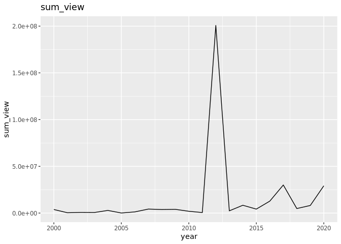
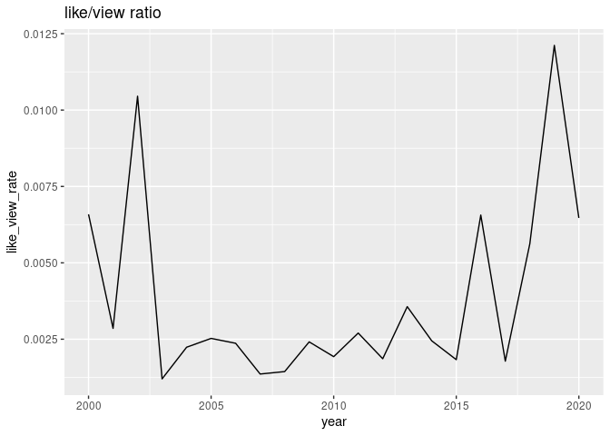
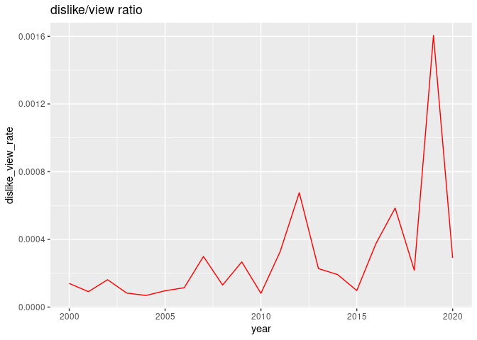
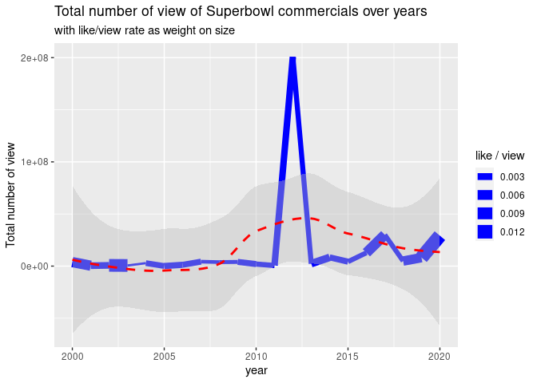
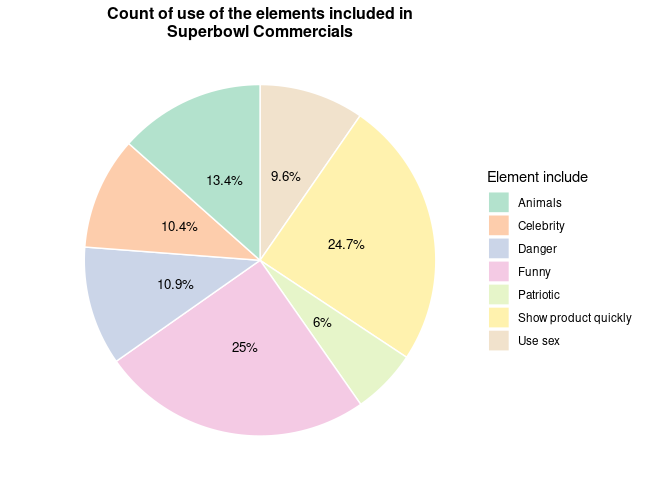

Holly-Plot1
================
Holly Cui
9/27/2021

### Introduction

Introduction to the question and what parts of the dataset are necessary
to answer the question. Also discuss why you’re interested in this
question.

### Approach

Describe what types of plots you are going to make to address your
question. For each plot, provide a clear explanation as to why this plot
(e.g. boxplot, barplot, histogram, etc.) is best for providing the
information you are asking about. The two plots should be of different
types, and at least one of the two plots needs to use either color
mapping or facets.

``` r
library(tidyverse)
```

    ## Warning in system("timedatectl", intern = TRUE): running command 'timedatectl'
    ## had status 1

    ## ── Attaching packages ─────────────────────────────────────── tidyverse 1.3.1 ──

    ## ✓ ggplot2 3.3.5     ✓ purrr   0.3.4
    ## ✓ tibble  3.1.4     ✓ dplyr   1.0.7
    ## ✓ tidyr   1.1.3     ✓ stringr 1.4.0
    ## ✓ readr   2.0.1     ✓ forcats 0.5.1

    ## ── Conflicts ────────────────────────────────────────── tidyverse_conflicts() ──
    ## x dplyr::filter() masks stats::filter()
    ## x dplyr::lag()    masks stats::lag()

``` r
library(lubridate)
```

    ## 
    ## Attaching package: 'lubridate'

    ## The following objects are masked from 'package:base':
    ## 
    ##     date, intersect, setdiff, union

``` r
youtube <- readr::read_csv('https://raw.githubusercontent.com/rfordatascience/tidytuesday/master/data/2021/2021-03-02/youtube.csv', show_col_types = FALSE)
youtube1 <- youtube
youtube1
```

    ## # A tibble: 247 × 25
    ##     year brand     superbowl_ads_d… youtube_url funny show_product_qu… patriotic
    ##    <dbl> <chr>     <chr>            <chr>       <lgl> <lgl>            <lgl>    
    ##  1  2018 Toyota    https://superbo… https://ww… FALSE FALSE            FALSE    
    ##  2  2020 Bud Light https://superbo… https://ww… TRUE  TRUE             FALSE    
    ##  3  2006 Bud Light https://superbo… https://ww… TRUE  FALSE            FALSE    
    ##  4  2018 Hynudai   https://superbo… https://ww… FALSE TRUE             FALSE    
    ##  5  2003 Bud Light https://superbo… https://ww… TRUE  TRUE             FALSE    
    ##  6  2020 Toyota    https://superbo… https://ww… TRUE  TRUE             FALSE    
    ##  7  2020 Coca-Cola https://superbo… https://ww… TRUE  FALSE            FALSE    
    ##  8  2020 Kia       https://superbo… https://ww… FALSE FALSE            FALSE    
    ##  9  2020 Hynudai   https://superbo… https://ww… TRUE  TRUE             FALSE    
    ## 10  2020 Budweiser https://superbo… https://ww… FALSE TRUE             TRUE     
    ## # … with 237 more rows, and 18 more variables: celebrity <lgl>, danger <lgl>,
    ## #   animals <lgl>, use_sex <lgl>, id <chr>, kind <chr>, etag <chr>,
    ## #   view_count <dbl>, like_count <dbl>, dislike_count <dbl>,
    ## #   favorite_count <dbl>, comment_count <dbl>, published_at <dttm>,
    ## #   title <chr>, description <chr>, thumbnail <chr>, channel_title <chr>,
    ## #   category_id <dbl>

``` r
# wrangle data grouped by year
youtube2 <- youtube1 %>%
  drop_na(year, view_count, like_count, dislike_count) %>%
  group_by(year) %>%
  summarise(sum_view = sum(view_count), sum_like = sum(like_count), sum_dislike = sum(dislike_count))
youtube2
```

    ## # A tibble: 21 × 4
    ##     year sum_view sum_like sum_dislike
    ##    <dbl>    <dbl>    <dbl>       <dbl>
    ##  1  2000  3824187    25192         534
    ##  2  2001   384265     1097          35
    ##  3  2002   699127     7308         113
    ##  4  2003   604098      726          50
    ##  5  2004  2841652     6358         195
    ##  6  2005    83106      210           8
    ##  7  2006  1265841     2996         145
    ##  8  2007  4277269     5819        1278
    ##  9  2008  3812796     5493         496
    ## 10  2009  4009584     9674        1070
    ## # … with 11 more rows

``` r
# ratio: `like/view` and `dislike/view`
youtube3 <- youtube2 %>%
  mutate(
    like_view_rate = sum_like/sum_view, 
    dislike_view_rate = sum_dislike/sum_view
  )
youtube3
```

    ## # A tibble: 21 × 6
    ##     year sum_view sum_like sum_dislike like_view_rate dislike_view_rate
    ##    <dbl>    <dbl>    <dbl>       <dbl>          <dbl>             <dbl>
    ##  1  2000  3824187    25192         534        0.00659         0.000140 
    ##  2  2001   384265     1097          35        0.00285         0.0000911
    ##  3  2002   699127     7308         113        0.0105          0.000162 
    ##  4  2003   604098      726          50        0.00120         0.0000828
    ##  5  2004  2841652     6358         195        0.00224         0.0000686
    ##  6  2005    83106      210           8        0.00253         0.0000963
    ##  7  2006  1265841     2996         145        0.00237         0.000115 
    ##  8  2007  4277269     5819        1278        0.00136         0.000299 
    ##  9  2008  3812796     5493         496        0.00144         0.000130 
    ## 10  2009  4009584     9674        1070        0.00241         0.000267 
    ## # … with 11 more rows

``` r
# Initial thought: a pure geom_line plot with view-count vs. year
ggplot(youtube3, aes(x = year, y = sum_view)) +
  geom_line() + 
  labs(
    title = "sum_view"
  )
```

<!-- -->

``` r
# However, from the plot, we saw point for 2012 has extremely higher value than points for other years. 
# This reminds us to take like_count and dislike_count into account and average on the total view count to see if the "outlier" can be balanced. 

# Plot ratio plot
ggplot(youtube3, aes(x = year)) +
  geom_line(aes(y = like_view_rate)) +
  labs(
    title = "like/view ratio"
  )
```

<!-- -->

``` r
ggplot(youtube3, aes(x = year)) +
  geom_line(aes(y = dislike_view_rate), color = "red") +
  labs(
    title = "dislike/view ratio"
  )
```

<!-- -->

``` r
# From the two lines (the reason why they are not put on the same plot is because of different scale of y axis), 
# we can see the outlier has been balanced. The pattern is different, which should be taken into account. 

# The final plot: 
ggplot(data = youtube3, aes(x = year, y = sum_view)) +
  geom_line(aes(size = like_view_rate), color = "blue") +
  stat_smooth(
  color = "red", fill = "grey",
  linetype = "dashed",
  method = "loess"
  ) +
  labs(
    y = "Total number of view",
    title = "Total number of view of Superbowl commercials over years",
    subtitle = "with like/view rate as weight on size",
    size = "like / view"
  )
```

    ## `geom_smooth()` using formula 'y ~ x'

<!-- -->

``` r
# The final plot takes into account three different aspects: the sum_view over years, sum of like count averaged on total view count, and the regression smoothed line with confidence interval. 
```

``` r
# Find the total number of TRUE values in each Boolean variable
funny_true_count = length(youtube1$funny[youtube1$funny == TRUE])
showproduct_true_count = length(youtube1$show_product_quickly[youtube1$show_product_quickly == TRUE])
patriotic_true_count = length(youtube1$patriotic[youtube1$patriotic == TRUE])
celebrity_true_count = length(youtube1$celebrity[youtube1$celebrity == TRUE])
danger_true_count = length(youtube1$danger[youtube1$danger == TRUE])
animals_true_count = length(youtube1$animals[youtube1$animals == TRUE])
use_sex_true_count = length(youtube1$use_sex[youtube1$use_sex == TRUE])
# Make a new dataframe based on the elements
youtube_pie_df <- tibble(
  category = c("Funny", "Show product quickly", "Patriotic", "Celebrity", "Danger", "Animals", "Use sex"),
  count = c(funny_true_count, showproduct_true_count, patriotic_true_count, celebrity_true_count, 
            danger_true_count, animals_true_count, use_sex_true_count)
)
# Compute the position of labels on the pie chart
youtube_pie_df <- youtube_pie_df %>% 
  arrange(desc(category)) %>%
  mutate(
    ypos = cumsum(count)- 0.5*count, 
    perc = count / sum(count) * 100, 
    percentage = paste0(round(perc, digits = 1), "%") 
    # create new variable regarding the proportion that each element takes up among total
    ) 

# Plot the chart
ggplot(youtube_pie_df, aes(x="", y=count, fill=category)) +
  geom_bar(stat="identity", width=1, color="white") +
  coord_polar("y", start=0) +
  theme_void() +
  geom_text(aes(y = ypos, label = percentage), color = "black", size=3.5) +
  scale_fill_brewer(palette="Pastel2") +
  labs(
    title = "Count of use of the elements included in\nSuperbowl Commercials", 
    fill = "Element include"
  ) +
  theme(
   plot.title = element_text(face = "bold", size = 12, hjust = 0.5)
  )
```

<!-- -->

### Analysis

provide the code that generates your plots. Use scale functions to
provide nice axis labels and guides.

### Discussion
