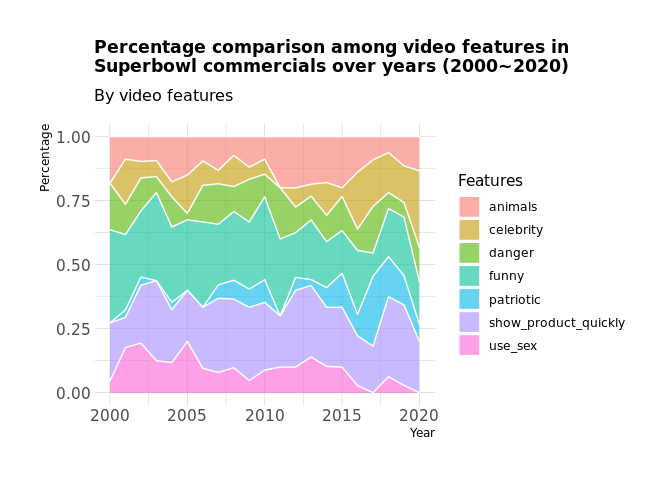

Holly-Plot1
================
Holly Cui
9/29/2021

### Introduction

Introduction to the question and what parts of the dataset are necessary
to answer the question. Also discuss why you’re interested in this
question.

### Approach

…We also used a stacked area chart to see how the proportion of each
feature change over the years. A stacked area chart is similarly plotted
as a stacked bar plot, but with lines connecting the elements with same
group, which is visually compatible when we plan to have year(time
variable) as our x axis. More specifically, over the years on the x
axis, we can see the relative percentage change of each video feature on
the y axis with areas divided by lines linking them together. The
percentage, or proportion, of each feature is calculated by first
counting the total number of TRUE-valued Boolean variable in each year
(“funny”, “patriotic”, etc.), and then generate a dataframe with all
21 years together.

``` r
library(tidyverse)
```

    ## ── Attaching packages ─────────────────────────────────────── tidyverse 1.3.1 ──

    ## ✓ ggplot2 3.3.5     ✓ purrr   0.3.4
    ## ✓ tibble  3.1.4     ✓ dplyr   1.0.7
    ## ✓ tidyr   1.1.3     ✓ stringr 1.4.0
    ## ✓ readr   2.0.1     ✓ forcats 0.5.1

    ## ── Conflicts ────────────────────────────────────────── tidyverse_conflicts() ──
    ## x dplyr::filter() masks stats::filter()
    ## x dplyr::lag()    masks stats::lag()

``` r
library(lubridate)
```

    ## 
    ## Attaching package: 'lubridate'

    ## The following objects are masked from 'package:base':
    ## 
    ##     date, intersect, setdiff, union

``` r
library(dplyr)
library(ggrepel)
library(viridis)
```

    ## Loading required package: viridisLite

``` r
library(hrbrthemes)
```

    ## NOTE: Either Arial Narrow or Roboto Condensed fonts are required to use these themes.

    ##       Please use hrbrthemes::import_roboto_condensed() to install Roboto Condensed and

    ##       if Arial Narrow is not on your system, please see https://bit.ly/arialnarrow

``` r
youtube <- readr::read_csv('https://raw.githubusercontent.com/rfordatascience/tidytuesday/master/data/2021/2021-03-02/youtube.csv', show_col_types = FALSE)
youtube1 <- youtube
```

### Analysis

``` r
# First, create a function that returns total count of a specific feature in one year.
count_feature_number <- function(data, feature_name, desired_year){
  count1 = 0
  for (i in seq(1, nrow(data))){
    if (data$year[i] == desired_year){
      if (data[i, feature_name] == TRUE){
        count1 = count1 + 1
      }
    }
  }
  return(count1)
}


# With help from the counter above, we define a new function that creates a 
## generalized feature counting dataframe for a single year.
generator <- function(data, year){
  funny_count = count_feature_number(data, "funny", year) 
  show_quickly_count = count_feature_number(data, "show_product_quickly", year)
  patriotic_count = count_feature_number(data, "patriotic", year)
  celebrity_count = count_feature_number(data, "celebrity", year)
  danger_count = count_feature_number(data, "danger", year)
  animals_count = count_feature_number(data, "animals", year)
  use_sex_count = count_feature_number(data, "use_sex", year)
  
  year_value <- rep(year, 7)
  count_of_feature <- c(funny_count, show_quickly_count, patriotic_count, 
                        celebrity_count, danger_count, animals_count, use_sex_count)
  features <- c("funny", "show_product_quickly", "patriotic", 
                "celebrity", "danger", "animals", "use_sex")
  year_table <- cbind(year_value, count_of_feature, features)
  year_df <- as.data.frame(year_table)
  return(year_df)
}


# Then, using the "appender" function below to get the final dataframe for 
## all years from 2000 to 2020. 
appender <- function(data){
  year_general_df <- generator(data, 2000)
  for (j in seq(2001, 2020)){
    year_general_df <- rbind(year_general_df, 
                             generator(data, j))
  }
  return(year_general_df)
}


# Use the function and get our desired plot
year_feature_df <- appender(youtube1)

year_feature <- year_feature_df %>%
  mutate(
    year_value = as.numeric(as.character(year_value)),
    count_of_feature = as.numeric(as.character(count_of_feature))
  ) %>%
  group_by(year_value, features) %>%
  summarise(n = sum(count_of_feature)) %>%
  mutate(percentage = n / sum(n))
```

    ## `summarise()` has grouped output by 'year_value'. You can override using the `.groups` argument.

``` r
year_feature
```

    ## # A tibble: 147 × 4
    ## # Groups:   year_value [21]
    ##    year_value features                 n percentage
    ##         <dbl> <fct>                <dbl>      <dbl>
    ##  1       2000 animals                  4     0.182 
    ##  2       2000 celebrity                0     0     
    ##  3       2000 danger                   4     0.182 
    ##  4       2000 funny                    8     0.364 
    ##  5       2000 patriotic                0     0     
    ##  6       2000 show_product_quickly     5     0.227 
    ##  7       2000 use_sex                  1     0.0455
    ##  8       2001 animals                  3     0.0882
    ##  9       2001 celebrity                6     0.176 
    ## 10       2001 danger                   4     0.118 
    ## # … with 137 more rows

``` r
# Plot stacked area chart
ggplot(year_feature, aes(x = year_value, y = percentage, fill = features)) + 
    geom_area(alpha=0.6 , size=.5, colour="white") +
    labs(
      x = "Year", 
      y = "Percentage", 
      fill = "Features",
      title = "Percentage comparison among video features in\nSuperbowl commercials over years (2000~2020)",
      subtitle = "By video features"
    ) + 
    theme_ipsum() +
    theme(
      plot.title = element_text(hjust = 0, size = 13)
    )
```

<!-- -->

``` r
# wrangle data grouped by year
youtube2 <- youtube1 %>%
  drop_na(year, view_count, like_count, dislike_count) %>%
  group_by(year) %>%
  summarise(sum_view = sum(view_count), sum_like = sum(like_count), sum_dislike = sum(dislike_count))
youtube2
```

    ## # A tibble: 21 × 4
    ##     year sum_view sum_like sum_dislike
    ##    <dbl>    <dbl>    <dbl>       <dbl>
    ##  1  2000  3824187    25192         534
    ##  2  2001   384265     1097          35
    ##  3  2002   699127     7308         113
    ##  4  2003   604098      726          50
    ##  5  2004  2841652     6358         195
    ##  6  2005    83106      210           8
    ##  7  2006  1265841     2996         145
    ##  8  2007  4277269     5819        1278
    ##  9  2008  3812796     5493         496
    ## 10  2009  4009584     9674        1070
    ## # … with 11 more rows

``` r
# ratio: `like/view` and `dislike/view`
youtube3 <- youtube2 %>%
  mutate(
    like_view_rate = sum_like/sum_view, 
    dislike_view_rate = sum_dislike/sum_view
  )
youtube3
```

    ## # A tibble: 21 × 6
    ##     year sum_view sum_like sum_dislike like_view_rate dislike_view_rate
    ##    <dbl>    <dbl>    <dbl>       <dbl>          <dbl>             <dbl>
    ##  1  2000  3824187    25192         534        0.00659         0.000140 
    ##  2  2001   384265     1097          35        0.00285         0.0000911
    ##  3  2002   699127     7308         113        0.0105          0.000162 
    ##  4  2003   604098      726          50        0.00120         0.0000828
    ##  5  2004  2841652     6358         195        0.00224         0.0000686
    ##  6  2005    83106      210           8        0.00253         0.0000963
    ##  7  2006  1265841     2996         145        0.00237         0.000115 
    ##  8  2007  4277269     5819        1278        0.00136         0.000299 
    ##  9  2008  3812796     5493         496        0.00144         0.000130 
    ## 10  2009  4009584     9674        1070        0.00241         0.000267 
    ## # … with 11 more rows

``` r
# Initial thought: a pure geom_line plot with view-count vs. year
ggplot(youtube3, aes(x = year, y = sum_view)) +
  geom_line() + 
  labs(
    title = "sum_view"
  )
```

<!-- -->

``` r
# However, from the plot, we saw point for 2012 has extremely higher value than points for other years. 
# This reminds us to take like_count and dislike_count into account and average on the total view count to see if the "outlier" can be balanced. 

# Plot ratio plot
ggplot(youtube3, aes(x = year)) +
  geom_line(aes(y = like_view_rate)) +
  labs(
    title = "like/view ratio"
  )
```

<!-- -->

``` r
ggplot(youtube3, aes(x = year)) +
  geom_line(aes(y = dislike_view_rate), color = "red") +
  labs(
    title = "dislike/view ratio"
  )
```

<!-- -->

``` r
# From the two lines (the reason why they are not put on the same plot is because of different scale of y axis), 
# we can see the outlier has been balanced. The pattern is different, which should be taken into account. 

# The final plot: 
ggplot(data = youtube3, aes(x = year, y = sum_view)) +
  geom_line(aes(size = like_view_rate), color = "blue") +
  stat_smooth(
  color = "red", fill = "grey",
  linetype = "dashed",
  method = "loess"
  ) +
  labs(
    y = "Total number of view",
    title = "Total number of view of Superbowl commercials over years",
    subtitle = "with like/view rate as weight on size",
    size = "like / view"
  )
```

    ## `geom_smooth()` using formula 'y ~ x'

<!-- -->

``` r
# The final plot takes into account three different aspects: the sum_view over years, sum of like count averaged on total view count, and the regression smoothed line with confidence interval. 
```

``` r
# Find the total number of TRUE values in each Boolean variable
funny_true_count = length(youtube1$funny[youtube1$funny == TRUE])
showproduct_true_count = length(youtube1$show_product_quickly[youtube1$show_product_quickly == TRUE])
patriotic_true_count = length(youtube1$patriotic[youtube1$patriotic == TRUE])
celebrity_true_count = length(youtube1$celebrity[youtube1$celebrity == TRUE])
danger_true_count = length(youtube1$danger[youtube1$danger == TRUE])
animals_true_count = length(youtube1$animals[youtube1$animals == TRUE])
use_sex_true_count = length(youtube1$use_sex[youtube1$use_sex == TRUE])
# Make a new dataframe based on the elements
youtube_pie_df <- tibble(
  category = c("Funny", "Show product quickly", "Patriotic", "Celebrity", "Danger", "Animals", "Use sex"),
  count = c(funny_true_count, showproduct_true_count, patriotic_true_count, celebrity_true_count, 
            danger_true_count, animals_true_count, use_sex_true_count)
)
# Compute the position of labels on the pie chart
youtube_pie_df <- youtube_pie_df %>% 
  arrange(desc(category)) %>%
  mutate(
    ypos = cumsum(count)- 0.5*count, 
    perc = count / sum(count) * 100, 
    percentage = paste0(round(perc, digits = 1), "%") 
    # create new variable regarding the proportion that each element takes up among total
    ) 

# Plot the chart
ggplot(youtube_pie_df, aes(x="", y=count, fill=category)) +
  geom_bar(stat="identity", width=1, color="white") +
  coord_polar("y", start=0) +
  theme_void() +
  geom_text(aes(y = ypos, label = percentage), color = "black", size=3.5) +
  scale_fill_brewer(palette="Pastel2") +
  labs(
    title = "Count of use of the elements included in\nSuperbowl Commercials", 
    fill = "Element include"
  ) +
  theme(
   plot.title = element_text(face = "bold", size = 12, hjust = 0.5)
  )
```

<!-- -->

### Discussion

In the stacked area plot, we should focus on the width of each color
bands, instead of trying to interpret the lines. Here, we can see that
over the years, `funny` and `show_product_quickly` take up the highest
proportion among the seven video features.
