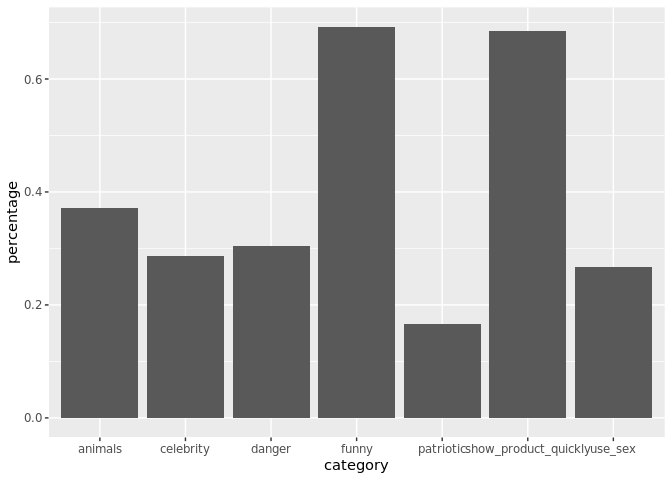
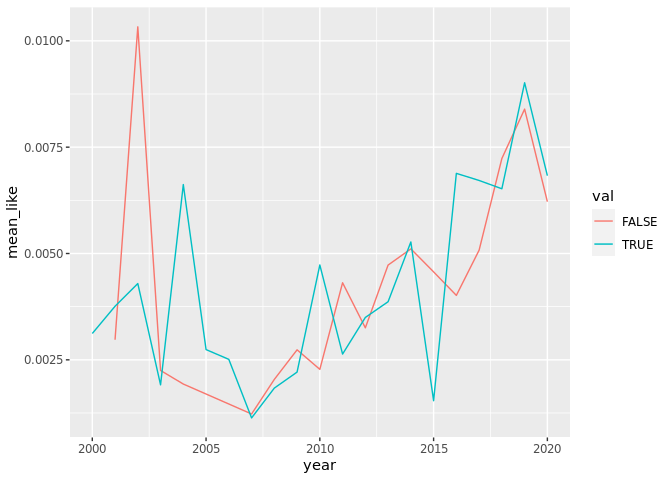
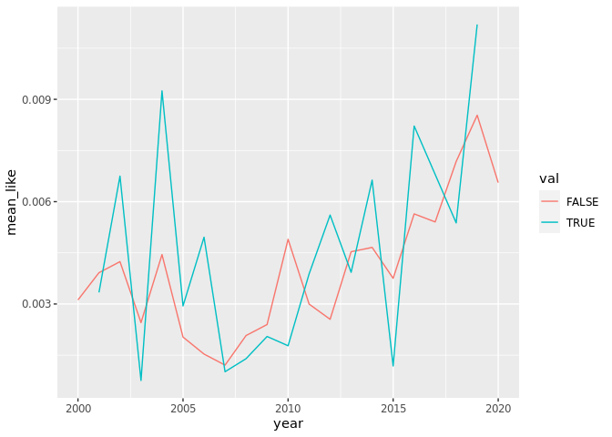
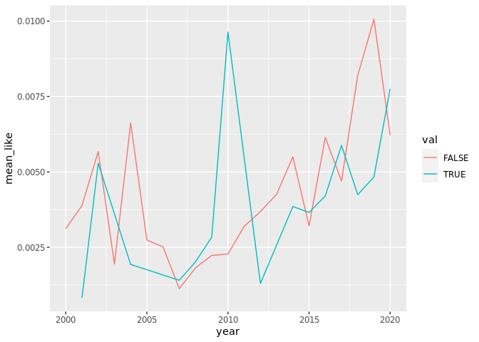
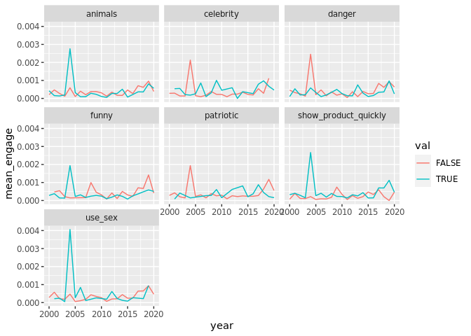

Yihan-plots
================
Yihan Shi
9/27/2021

### Introduction

Introduction to the question and what parts of the dataset are necessary
to answer the question. Also discuss why you’re interested in this
question.

### Approach

Describe what types of plots you are going to make to address your
question. For each plot, provide a clear explanation as to why this plot
(e.g. boxplot, barplot, histogram, etc.) is best for providing the
information you are asking about. The two plots should be of different
types, and at least one of the two plots needs to use either color
mapping or facets.

``` r
library(tidyverse)
```

    ## ── Attaching packages ─────────────────────────────────────── tidyverse 1.3.1 ──

    ## ✓ ggplot2 3.3.5     ✓ purrr   0.3.4
    ## ✓ tibble  3.1.4     ✓ dplyr   1.0.7
    ## ✓ tidyr   1.1.3     ✓ stringr 1.4.0
    ## ✓ readr   2.0.1     ✓ forcats 0.5.1

    ## ── Conflicts ────────────────────────────────────────── tidyverse_conflicts() ──
    ## x dplyr::filter() masks stats::filter()
    ## x dplyr::lag()    masks stats::lag()

``` r
library(ggplot2)
library(cowplot)
```

``` r
youtube <- readr::read_csv('https://raw.githubusercontent.com/rfordatascience/tidytuesday/master/data/2021/2021-03-02/youtube.csv', show_col_types = FALSE)

glimpse(youtube)
```

    ## Rows: 247
    ## Columns: 25
    ## $ year                      <dbl> 2018, 2020, 2006, 2018, 2003, 2020, 2020, 20…
    ## $ brand                     <chr> "Toyota", "Bud Light", "Bud Light", "Hynudai…
    ## $ superbowl_ads_dot_com_url <chr> "https://superbowl-ads.com/good-odds-toyota/…
    ## $ youtube_url               <chr> "https://www.youtube.com/watch?v=zeBZvwYQ-hA…
    ## $ funny                     <lgl> FALSE, TRUE, TRUE, FALSE, TRUE, TRUE, TRUE, …
    ## $ show_product_quickly      <lgl> FALSE, TRUE, FALSE, TRUE, TRUE, TRUE, FALSE,…
    ## $ patriotic                 <lgl> FALSE, FALSE, FALSE, FALSE, FALSE, FALSE, FA…
    ## $ celebrity                 <lgl> FALSE, TRUE, FALSE, FALSE, FALSE, TRUE, TRUE…
    ## $ danger                    <lgl> FALSE, TRUE, TRUE, FALSE, TRUE, TRUE, FALSE,…
    ## $ animals                   <lgl> FALSE, FALSE, TRUE, FALSE, TRUE, TRUE, TRUE,…
    ## $ use_sex                   <lgl> FALSE, FALSE, FALSE, FALSE, TRUE, FALSE, FAL…
    ## $ id                        <chr> "zeBZvwYQ-hA", "nbbp0VW7z8w", "yk0MQD5YgV8",…
    ## $ kind                      <chr> "youtube#video", "youtube#video", "youtube#v…
    ## $ etag                      <chr> "rn-ggKNly38Cl0C3CNjNnUH9xUw", "1roDoK-SYqSp…
    ## $ view_count                <dbl> 173929, 47752, 142310, 198, 13741, 23636, 30…
    ## $ like_count                <dbl> 1233, 485, 129, 2, 20, 115, 1470, 78, 342, 7…
    ## $ dislike_count             <dbl> 38, 14, 15, 0, 3, 11, 384, 6, 7, 0, 14, 0, 2…
    ## $ favorite_count            <dbl> 0, 0, 0, 0, 0, 0, 0, 0, 0, 0, 0, 0, 0, 0, 0,…
    ## $ comment_count             <dbl> NA, 14, 9, 0, 2, 13, 227, 6, 30, 0, 8, 1, 13…
    ## $ published_at              <dttm> 2018-02-03 11:29:14, 2020-01-31 21:04:13, 2…
    ## $ title                     <chr> "Toyota Super Bowl Commercial 2018 Good Odds…
    ## $ description               <chr> "Toyota Super Bowl Commercial 2018 Good Odds…
    ## $ thumbnail                 <chr> "https://i.ytimg.com/vi/zeBZvwYQ-hA/sddefaul…
    ## $ channel_title             <chr> "Funny Commercials", "VCU Brandcenter", "Joh…
    ## $ category_id               <dbl> 1, 27, 17, 22, 24, 1, 24, 2, 24, 24, 24, 24,…

``` r
# calcualte percentages for each category
nr <- nrow(youtube)

funny_perc <-  sum(youtube$funny)/nr
show_product_quickly_perc <- sum(youtube$show_product_quickly)/nr
patriotic_perc <-  sum(youtube$patriotic)/nr
celebrity_perc <- sum(youtube$celebrity)/nr
danger_perc <- sum(youtube$danger)/nr
animals_perc <- sum(youtube$animals)/nr
use_sex_perc <- sum(youtube$use_sex)/nr

# make dataframe
percentage_table <- tribble(
  ~category, ~percentage,
  'funny', funny_perc,
  'show_product_quickly', show_product_quickly_perc,
  'patriotic', patriotic_perc,
  'celebrity', celebrity_perc,
  'danger', danger_perc,
  'animals', animals_perc,
  'use_sex', use_sex_perc
)

percentage_table
```

    ## # A tibble: 7 × 2
    ##   category             percentage
    ##   <chr>                     <dbl>
    ## 1 funny                     0.692
    ## 2 show_product_quickly      0.684
    ## 3 patriotic                 0.166
    ## 4 celebrity                 0.287
    ## 5 danger                    0.304
    ## 6 animals                   0.372
    ## 7 use_sex                   0.267

``` r
ggplot(percentage_table, aes(x = category, y = percentage)) + 
  geom_col() + 
  scale_colour_brewer(palette = "Pastel1")
```

<!-- -->

``` r
# create compare for different categories

create_compare <- function(varname, full_data) {
  full_data <- full_data %>% 
    drop_na({{varname}}, like_count, view_count, dislike_count, comment_count) %>% 
    mutate(avg_like = like_count / view_count,
           avg_dislike = dislike_count / view_count,
           avg_engage = comment_count / view_count,
           feature = as_label(enquo(varname))) %>% 
    select({{varname}}, avg_like, avg_dislike, avg_engage, feature, year) %>%
    rename(val = as_label(enquo(varname)))
  return(full_data)
}
```

(Function was written with the help of TA)

``` r
all_compare <- rbind(create_compare(funny, youtube),
                     create_compare(danger, youtube),
                     create_compare(show_product_quickly, youtube),
                     create_compare(patriotic, youtube),
                     create_compare(celebrity, youtube),
                     create_compare(animals, youtube),
                     create_compare(use_sex, youtube))
```

``` r
like_plot <- ggplot(all_compare, aes(x = avg_like, y = feature, color = val)) +
  geom_boxplot()

dislike_plot <- ggplot(all_compare, aes(x = avg_dislike, y = feature, color = val)) +
  geom_boxplot()

engage_plot <- ggplot(all_compare, aes(x = avg_engage, y = feature, color = val)) +
  geom_boxplot()

like_plot
```

<!-- -->

``` r
dislike_plot
```

<!-- -->

``` r
engage_plot
```

<!-- -->

``` r
funny_over_years <- all_compare %>% 
  filter(feature == 'funny') %>% 
  group_by(year, val) %>% 
  summarise(mean_like = mean(avg_like))
```

    ## `summarise()` has grouped output by 'year'. You can override using the `.groups` argument.

``` r
ggplot(funny_over_years, aes(x = year, y = mean_like, group = val)) + 
  geom_line(aes(color = val))
```

<!-- -->

``` r
animals_over_years <- all_compare %>% 
  filter(feature == 'animals') %>% 
  group_by(year, val) %>% 
  summarise(mean_like = mean(avg_like))
```

    ## `summarise()` has grouped output by 'year'. You can override using the `.groups` argument.

``` r
ggplot(animals_over_years, aes(x = year, y = mean_like, group = val)) + 
  geom_line(aes(color = val))
```

<!-- -->

``` r
use_sex_over_years <- all_compare %>% 
  filter(feature == 'use_sex') %>% 
  group_by(year, val) %>% 
  summarise(mean_like = mean(avg_like))
```

    ## `summarise()` has grouped output by 'year'. You can override using the `.groups` argument.

``` r
ggplot(use_sex_over_years, aes(x = year, y = mean_like, group = val)) + 
  geom_line(aes(color = val))
```

<!-- -->

``` r
patriotic_over_years <- all_compare %>% 
  filter(feature == 'patriotic') %>% 
  group_by(year, val) %>% 
  summarise(mean_like = mean(avg_like))
```

    ## `summarise()` has grouped output by 'year'. You can override using the `.groups` argument.

``` r
ggplot(patriotic_over_years, aes(x = year, y = mean_like, group = val)) + 
  geom_line(aes(color = val))
```

<!-- -->

``` r
year_compare <- all_compare %>% 
  filter(val == TRUE) %>% 
  group_by(year, val, feature) %>% 
  summarise(mean_like = mean(avg_like))
```

    ## `summarise()` has grouped output by 'year', 'val'. You can override using the `.groups` argument.

``` r
ggplot(year_compare, aes(x = year, y = mean_like)) + 
  geom_line() + 
  facet_grid(feature ~ .)
```

<!-- -->

### Analysis

provide the code that generates your plots. Use scale functions to
provide nice axis labels and guides.

### Discussion
