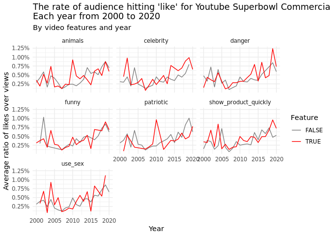
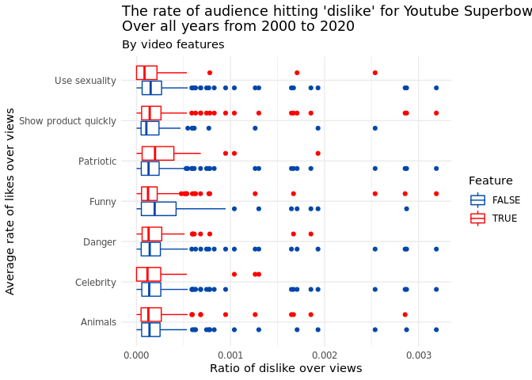
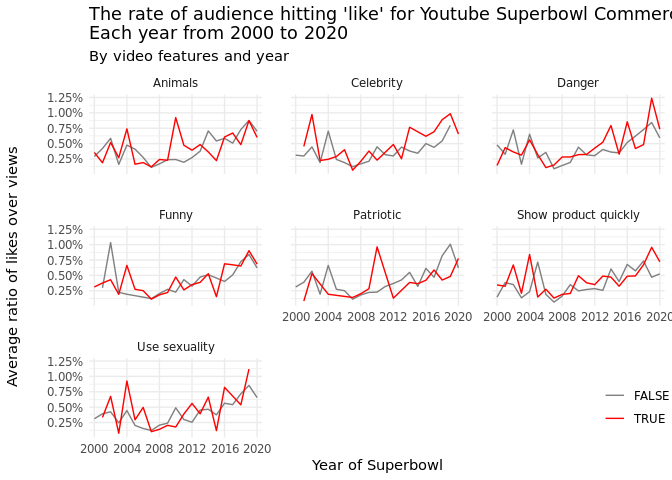
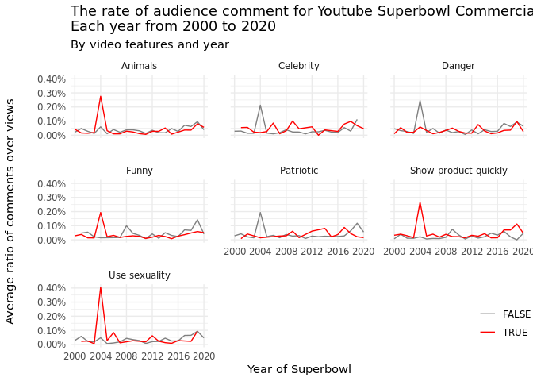

Yihan-plots
================
Yihan Shi
9/27/2021

### Introduction

We want to explore the trends in how the ads change over the years in
terms of content, audience preferences, and engagement. To explore
audience preference and engagement, like\_count, comment\_count, and
view\_count are used to calculate ratio of like/engagement over total
views. We also use logical variables such as `funny`, `danger`, etc. to
differentiate the changes over years by each feature.

### Approach

First, we used a line graphs faceted by `feature`, a variable that is
created using all logical variables in the data set. The faceted line
graph is suitable for time-dependent changes by each categorical
variable. Because the logical variables are either true or false, 2
different lines in each sub-plot clearly show how the trends (audience
preference in this case) differ if an ad contains a feature or not.

We also used a stacked bar plot to see how the proportion of each
feature change over the years.

### Analysis

``` r
library(tidyverse)
```

    ## ── Attaching packages ─────────────────────────────────────── tidyverse 1.3.1 ──

    ## ✓ ggplot2 3.3.5     ✓ purrr   0.3.4
    ## ✓ tibble  3.1.4     ✓ dplyr   1.0.7
    ## ✓ tidyr   1.1.3     ✓ stringr 1.4.0
    ## ✓ readr   2.0.1     ✓ forcats 0.5.1

    ## ── Conflicts ────────────────────────────────────────── tidyverse_conflicts() ──
    ## x dplyr::filter() masks stats::filter()
    ## x dplyr::lag()    masks stats::lag()

``` r
library(ggplot2)
library(scales)
```

    ## 
    ## Attaching package: 'scales'

    ## The following object is masked from 'package:purrr':
    ## 
    ##     discard

    ## The following object is masked from 'package:readr':
    ## 
    ##     col_factor

``` r
youtube <- readr::read_csv('https://raw.githubusercontent.com/rfordatascience/tidytuesday/master/data/2021/2021-03-02/youtube.csv', 
                           show_col_types = FALSE)
```

``` r
# create compare function for different categories
create_compare <- function(varname, full_data) {
  full_data <- full_data %>% 
    # drop N/A value for key variables 
    drop_na({{varname}}, like_count, view_count, dislike_count, comment_count) %>% 
    # create new variables for preference, dislike, engagement, and features
    mutate(like = like_count / view_count,
           dislike = dislike_count / view_count,
           engage = comment_count / view_count,
           feature = as_label(enquo(varname))) %>% 
    select({{varname}}, like, dislike, engage, feature, year) %>%
    rename(val = as_label(enquo(varname)))
  return(full_data)
}
```

(Function was written with the help of TA)

``` r
# create a new data frame that contains key variables from above 
all_compare <- rbind(create_compare(funny, youtube),
                     create_compare(danger, youtube),
                     create_compare(show_product_quickly, youtube),
                     create_compare(patriotic, youtube),
                     create_compare(celebrity, youtube),
                     create_compare(animals, youtube),
                     create_compare(use_sex, youtube)) %>% 
  # change variable names to be more readable
  mutate(feature = recode(feature, 'animals' = 'Animals', 
                          'celebrity' = 'Celebrity', 
                          'danger' = 'Danger',
                          'funny' = 'Funny',
                          'patriotic' = 'Patriotic',
                          'show_product_quickly' = 'Show product quickly',
                          'use_sex' = 'Use sexuality'))
```

``` r
like_plot <- ggplot(all_compare, aes(x = like, y = feature, color = val)) +
  geom_boxplot(aes(color = val)) + 
  labs(title = "The rate of audience hitting 'like' for Youtube Superbowl Commercials\nOver all years from 2000 to 2020",
       subtitle = "By video features",
       x = "Ratio of like over views",
       y = "Average rate of likes over views") +
  scale_color_manual("Feature", values = c("#0047AB", "#FF0000")) +
  theme_minimal()
```

``` r
dislike_plot <- ggplot(all_compare, aes(x = dislike, y = feature, color = val)) +
  geom_boxplot(aes(color = val)) + 
  labs(title = "The rate of audience hitting 'dislike' for Youtube Superbowl Commercials\nOver all years from 2000 to 2020",
       subtitle = "By video features",
       x = "Ratio of dislike over views",
       y = "Average rate of likes over views") +
  scale_color_manual("Feature", values = c("#0047AB", "#FF0000")) +
  theme_minimal()
```

``` r
like_plot
```

<!-- -->

``` r
dislike_plot
```

<!-- -->

``` r
# create new dataset for facetting
feature_over_years <- all_compare %>% 
  mutate(feature = recode(feature, 'animals' = 'Animals', 
                          'celebrity' = 'Celebrity', 
                          'danger' = 'Danger',
                          'funny' = 'Funny',
                          'patriotic' = 'Patriotic',
                          'show_product_quickly' = 'Show product quickly',
                          'use_sex' = 'Use sexuality')) %>% 
  group_by(year, feature, val) %>% 
  summarise(mean_like = mean(like),
            mean_engage = mean(engage))
```

    ## `summarise()` has grouped output by 'year', 'feature'. You can override using the `.groups` argument.

``` r
ggplot(feature_over_years, aes(x = as.numeric(year), y = mean_like)) + 
  geom_line(aes(color = val)) + 
  labs(title = "The rate of audience hitting 'like' for Youtube Superbowl Commercials\nEach year from 2000 to 2020",
       subtitle = "By video features and year",
       x = "Year of Superbowl",
       y = "Average ratio of likes over views") +
  facet_wrap(~feature) +
  scale_color_manual("Feature", values = c("#808080", "#FF0000")) +
  scale_y_continuous(labels = label_percent(accuracy = NULL, scale = 100, prefix = "",
                                            suffix = "%", big.mark = " ", decimal.mark = ".", trim = TRUE)) +
  scale_x_discrete(limits=c(2000,2004,2008,2012,2016,2020)) + 
  theme_minimal() +
  theme(axis.title.x = element_text(hjust = 0.5),
        axis.title.y = element_text(margin = margin(r = 20),
                                    hjust = 0.5),
        panel.spacing = unit(1.5, "lines"),
        legend.position = c(0.95, 0.1),
        legend.title = element_blank())
```

    ## Warning: Continuous limits supplied to discrete scale.
    ## Did you mean `limits = factor(...)` or `scale_*_continuous()`?

<!-- -->

``` r
ggplot(feature_over_years, aes(x = as.numeric(year), y = mean_engage)) + 
  geom_line(aes(color = val)) + 
  labs(title = "The rate of audience comment for Youtube Superbowl Commercials\nEach year from 2000 to 2020",
       subtitle = "By video features and year",
       x = "Year of Superbowl",
       y = "Average ratio of comments over views") +
  facet_wrap(~feature) +
  scale_color_manual("Feature", values = c("#808080", "#FF0000")) +
  scale_y_continuous(labels = label_percent(accuracy = NULL, scale = 100, prefix = "",
                                            suffix = "%", big.mark = " ", decimal.mark = ".", trim = TRUE)) +
  scale_x_discrete(limits=c(2000,2004,2008,2012,2016,2020)) + 
  theme_minimal() +
  theme(axis.title.x = element_text(hjust = 0.5),
        axis.title.y = element_text(margin = margin(r = 20),
                                    hjust = 0.5),
        panel.spacing = unit(1.5, "lines"),
        legend.position = c(0.95, 0.1),
        legend.title = element_blank())
```

    ## Warning: Continuous limits supplied to discrete scale.
    ## Did you mean `limits = factor(...)` or `scale_*_continuous()`?

<!-- -->

### Discussion

First, we look at audience preference of various features in ads. From
2000 to 2020, the ads that contain dangerous elements are getting more
likes than ads that do not contain dangerous elements. There is no
obvious trend that the audience strongly prefer a specific feature other
than `danger` over the years.In certain years, audience feel strongly
about ads that contain specific features. In 2010, ads that contain
`animals` element are liked more than 3 times compared to ads that do
not contain animals. Same observation is shown for ads containing
`patriotic` element in 2010. However, from 2017 to 2020, ads that
contain `patriotic` content become less liked. Ads that use sexuality
are far more liked in 2004 but are less liked in 2015. In 2002, the ads
that have no humorous element are liked almost 3 times as ads that have
humorous element.

Then, we look at what kinds of ads elicit the audience to engage by
commenting. In general, the engagement rate is pretty low. Most ads
receive almost no comments. However, in 2004 specifically there is are
significant differences between engagement rate for all features. Ads
that contain `animal`, `funny`, show product quickly, or use sexuality
shows higher engagement compared the ads that don’t contain these
features. On the other hand, ads that don’t contain `celebrity`,
`patriotic`, or `danger` tend to have higher engagement rates.

The year variable used here denotes the Superbowl year where the
commercial was shown. However, some commercials have a different
published date on Youtube. Furthermore, the youtube videos have been
collected from random Youtube users instead of influncers or offial
commercial accounts. Therefore, the views, likes, and engagement also
depend on the account itself.
